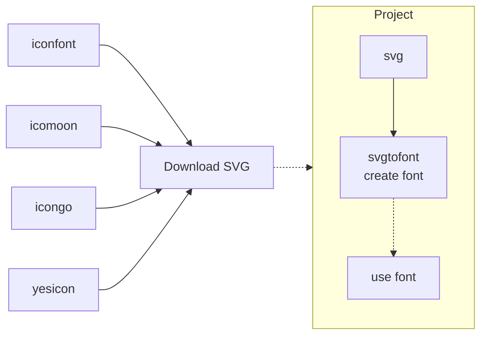

[Free Font](https://github.com/jaywcjlove/free-font)

<p align="center">
  <a href="https://github.com/jaywcjlove/svgtofont/">
    
  </a>
</p>

<p align="center">
  <a href="https://jaywcjlove.github.io/#/sponsor" target="_blank">
    
  </a>
  <a href="https://github.com/jaywcjlove/svgtofont/actions">
    
  </a>
  <a href="https://gitee.com/jaywcjlove/svgtofont">
    
  </a>
  <a href="https://uiwjs.github.io/npm-unpkg/#/pkg/svgtofont/file/README.md">
    
  </a>
  <a href="https://www.npmjs.com/package/svgtofont">
    
  </a>
  <a href="https://www.npmjs.com/package/svgtofont">
    
  </a>
</p>

Read a set of SVG icons and ouput a TTF/EOT/WOFF/WOFF2/SVG font, Generator of fonts from SVG icons.

[Install](#install) · [Usage](#using-with-nodejs) · [Command](#using-with-command) · [Font Usage](#font-usage) · [API](#api) · [options](#options) · [npm](http://npm.im/svgtofont) · [License](#license)

**Features:**  

- Supported font formats: `WOFF2`, `WOFF`, `EOT`, `TTF` and `SVG`.
- Support SVG Symbol file.
- Support [`React`](https://github.com/facebook/react), [`ReactNative`](https://github.com/facebook/react-native) & [`TypeScript`](https://github.com/microsoft/TypeScript).
- Support [`Less`](https://github.com/less/less.js)/[`Sass`](https://github.com/sass/sass)/[`Stylus`](https://github.com/stylus/stylus).
- Allows to use custom templates (example `css`, `less` and etc).
- Automatically generate a preview site.

```bash
                                ╭┈┈┈┈┈┈┈┈┈┈┈┈┈┈┈┈┈┈┈┈╮
                                ┆      Project       ┆
                                ┆   ╭┈┈┈┈┈┈┈┈┈┈┈╮    ┆
╭┈┈┈┈┈┈┈┈╮                      ┆   ┆    svg    ┆┈┈╮ ┆
┆iconfont┆┈┈╮                   ┆   ╰┈┈┈┈┈┈┈┈┈┈┈╯  ┆ ┆
╰┈┈┈┈┈┈┈┈╯  ┆  ╭┈┈┈┈┈┈┈┈┈┈┈┈╮   ┆   ╭┈┈┈┈┈┈┈┈┈┈┈╮  ┆ ┆
            ├┈▶┆download svg┆┈┈▶┆   ┆┈svgtofont┈┆  ┆ ┆
╭┈┈┈┈┈┈┈┈╮  ┆  ╰┈┈┈┈┈┈┈┈┈┈┈┈╯   ┆╭┈┈┆create font┆◀┈╯ ┆
┆icomoon ┆┈┈╯                   ┆┆  ╰┈┈┈┈┈┈┈┈┈┈┈╯    ┆
╰┈┈┈┈┈┈┈┈╯                      ┆┆  ╭┈┈┈┈┈┈┈┈┈┈┈╮    ┆
                                ┆╰┈▶┆ use font  ┆    ┆
                                ┆   ╰┈┈┈┈┈┈┈┈┈┈┈╯    ┆
                                ╰┈┈┈┈┈┈┈┈┈┈┈┈┈┈┈┈┈┈┈┈╯
```



**Icon Font Created By svgtofont**

- [file-icons](https://uiwjs.github.io/file-icons/) File icons in the file tree.
- [uiw-iconfont](https://github.com/uiwjs/icons) The premium icon font for [@uiwjs](https://github.com/uiwjs) Component Library. Support [`React`](https://github.com/facebook/react) & [`TypeScript`](https://github.com/microsoft/TypeScript).
- [Bootstrap Icons Font](https://github.com/uiwjs/bootstrap-icons) Official open source SVG icon library for Bootstrap.
- [test example](./test) For a simple test example, run `npm run test` in the root directory to see the results.

## Install

```bash
npm i svgtofont
```

> [!NOTE]  
> This package `v5+` is [ESM only](https://gist.github.com/sindresorhus/a39789f98801d908bbc7ff3ecc99d99c): Node 18+ is needed to use it and it must be `import` instead of `require`.  
> ```js
> import svgtofont from 'svgtofont';
> ```

#### Using With Command

```json
{
  "scripts": {
    "font": "svgtofont --sources ./svg --output ./font --fontName uiw-font"
  },
  "svgtofont": {
    "css": {
      "fontSize": "12px"
    }
  }
}
```

You can add configuration to package.json. [#48](https://github.com/jaywcjlove/svgtofont/issues/48)

Support for `.svgtofontrc` and [more](https://github.com/jaywcjlove/auto-config-loader/blob/add7ae012f5c3903296fbf0ef06e3631e379c2cc/core/README.md?plain=1#L106-L135) configuration files.

```js
{
  "fontName": "svgtofont",
  "css": true
}
```

```js
/**
 * @type {import('svgtofont').SvgToFontOptions}
 */
export default {
  fontName: "iconfont",
}
```

#### Using With Nodejs

> [!NOTE]  
> This package `v5+` is now pure ESM. Please [read this](https://gist.github.com/sindresorhus/a39789f98801d908bbc7ff3ecc99d99c).

```js
import svgtofont from 'svgtofont';
import path from 'node:path';
 
svgtofont({
  src: path.resolve(process.cwd(), 'icon'), // svg path
  dist: path.resolve(process.cwd(), 'fonts'), // output path
  fontName: 'svgtofont', // font name
  css: true, // Create CSS files.
}).then(() => {
  console.log('done!');
});
```

Or

```js
import svgtofont from 'svgtofont';
import path from 'node:path';

svgtofont({
  src: path.resolve(process.cwd(), "icon"), // svg path
  dist: path.resolve(process.cwd(), "fonts"), // output path
  styleTemplates: path.resolve(rootPath, "styles"), // file templates path (optional)
  fontName: "svgtofont", // font name
  css: true, // Create CSS files.
  startUnicode: 0xea01, // unicode start number
  svgicons2svgfont: {
    fontHeight: 1000,
    normalize: true
  },
  // website = null, no demo html files
  website: {
    title: "svgtofont",
    // Must be a .svg format image.
    logo: path.resolve(process.cwd(), "svg", "git.svg"),
    version: pkg.version,
    meta: {
      description: "Converts SVG fonts to TTF/EOT/WOFF/WOFF2/SVG format.",
      keywords: "svgtofont,TTF,EOT,WOFF,WOFF2,SVG"
    },
    description: ``,
    // Add a Github corner to your website
    // Like: https://github.com/uiwjs/react-github-corners
    corners: {
      url: 'https://github.com/jaywcjlove/svgtofont',
      width: 62, // default: 60
      height: 62, // default: 60
      bgColor: '#dc3545' // default: '#151513'
    },
    links: [
      {
        title: "GitHub",
        url: "https://github.com/jaywcjlove/svgtofont"
      },
      {
        title: "Feedback",
        url: "https://github.com/jaywcjlove/svgtofont/issues"
      },
      {
        title: "Font Class",
        url: "index.html"
      },
      {
        title: "Unicode",
        url: "unicode.html"
      }
    ],
    footerInfo: `Licensed under MIT. (Yes it's free and <a href="https://github.com/jaywcjlove/svgtofont">open-sourced</a>`
  }
}).then(() => {
  console.log('done!');
});;
```

## API

```js
import { createSVG, createTTF, createEOT, createWOFF, createWOFF2, createSvgSymbol, copyTemplate, createHTML } from 'svgtofont/lib/utils';

const options = { ... };

async function creatFont() {
  const unicodeObject = await createSVG(options); 
  const ttf = await createTTF(options); // SVG Font => TTF
  await createEOT(options, ttf); // TTF => EOT
  await createWOFF(options, ttf); // TTF => WOFF
  await createWOFF2(options, ttf); // TTF => WOFF2
  await createSvgSymbol(options); // SVG Files => SVG Symbol
}
```

## options

> svgtofont(options)

### config

> Type: `config?: AutoConfOption<SvgToFontOptions>`

By default, settings are automatically loaded from `.svgtofontrc` and `package.json`. You can add configuration to `package.json`. [#48](https://github.com/jaywcjlove/svgtofont/issues/48)

Support for `.svgtofontrc` and [more](https://github.com/jaywcjlove/auto-config-loader/blob/add7ae012f5c3903296fbf0ef06e3631e379c2cc/core/README.md?plain=1#L106-L135) configuration files.

### log

> Type: `Boolean`  

A value of `false` disables logging

### logger

> Type: `(msg) => void`  

log callback function

### dist

> Type: `String`  
> Default value: ~~`dist`~~ => `fonts`  

The output directory.

### outSVGReact

> Type: `Boolean`  
> Default value: `false`  

Output `./dist/react/`, SVG generates `react` components.

```js
git/git.svg

// ↓↓↓↓↓↓↓↓↓↓

import React from 'react';
export const Git = props => (
  <svg viewBox="0 0 20 20" {...props}><path d="M2.6 10.59L8.38 4.8l1.69 -." fillRule="evenodd" /></svg>
);
```

### outSVGReactNative

> Type: `Boolean`  
> Default value: `false`

Output `./dist/reactNative/`, SVG generates `reactNative` components.

```js
import { Text } from 'react-native';

const icons = { "Git": "__GitUnicodeChar__", "Adobe": "__AdobeUnicodeChar__" };

export const RangeIconFont = props => {
  const { name, ...rest } = props;
  return (<Text style={{ fontFamily: 'svgtofont', fontSize: 16, color: '#000000', ...rest }}>
    {icons[name]}
  </Text>);
};

```

### outSVGPath

> Type: `Boolean`  
> Default value: `false`  

Output `./dist/svgtofont.json`, The content is as follows:

```js
{
  "adobe": ["M14.868 3H23v19L14.868 3zM1 3h8.138L1 22V3zm.182 11.997H13.79l-1.551-3.82H8.447z...."],
  "git": ["M2.6 10.59L8.38 4.8l1.69 1.7c-.24.85.15 1.78.93 2.23v5.54c-.6.34-1 .99-1..."],
  "stylelint": ["M129.74 243.648c28-100.109 27.188-100.5.816c2.65..."]
}
```

Or you can generate the file separately: 

```js
const { generateIconsSource } = require('svgtofont/src/generate');	
const path = require('path');	

async function generate () {	
  const outPath = await generateIconsSource({	
    src: path.resolve(process.cwd(), 'svg'),	
    dist: path.resolve(process.cwd(), 'dist'),	
    fontName: 'svgtofont',	
  });	
}	

generate();
```

### generateInfoData

> Type: `Boolean`  
> Default value: `false`  

Output `./dist/info.json`, The content is as follows:

```js
{
  "adobe": {
    "encodedCode": "\\ea01",
    "prefix": "svgtofont",
    "className": "svgtofont-adobe",
    "unicode": "&#59905;"
  },
  ...
}
```

### src

> Type: `String`  
> Default value: `svg`  

output path

### emptyDist

> Type: `String`  
> Default value: `false`  

Clear output directory contents

### fontName

> Type: `String`  
> Default value: `iconfont`

The font family name you want.

### styleTemplates

> Type: `String`
> Default value: `undefined`

The path of the templates, see `src/styles` or `test/templates/styles` to get reference about 
  how to create a template, file names can have the extension .template, like a `filename.scss.template`

### startUnicode

> Type: `Number`  
> Default value: `0xea01`  

unicode start number

### getIconUnicode

Get Icon Unicode

```ts
getIconUnicode?: (name: string, unicode: string, startUnicode: number) 
      => [string, number];
```

### useNameAsUnicode

> Type: `Boolean`  
> Default value: `false`  

should the name(file name) be used as unicode? this switch allows for the support of ligatures.

let's say you have an svg with a file name of `add` and you want to use ligatures for it. you would set up your processing as mentioned above and turn on this switch.
```js
{
  ...
  useNameAsUnicode: true
}
```
while processing, instead of using a single sequential char for the unicode, it uses the file name. using the file name as the unicode allows the following code to work as expected.
```css
.icons {
  font-family: 'your-font-icon-name' !important;
  font-size: 16px;
  font-style: normal;
  -webkit-font-smoothing: antialiased;
  -moz-osx-font-smoothing: grayscale;
}
```
```html
<i class="icons">add</i>
```
as you add more svgs and process them into your font you would just use the same pattern.
```html
<i class="icons">add</i>
<i class="icons">remove</i>
<i class="icons">edit</i>
```

### useCSSVars

> Type: `Boolean`  
> Default value: `false`  

consoles whenever {{ cssString }} template outputs unicode characters or css vars

### classNamePrefix

> Type: `String`  
> Default value: font name  

Create font class name prefix, default value font name.

### css

> Type: `Boolean|CSSOptions`  
> Default value: `false`  

Create CSS/LESS files, default `true`.

```ts
type CSSOptions = {
  /**
   * Output the css file to the specified directory
   */
  output?: string;
  /**
   * Which files are exported.
   */
  include?: RegExp;
  /**
   * Setting font size.
   */
  fontSize?: string;
  /**
   * Set the path in the css file
   * https://github.com/jaywcjlove/svgtofont/issues/48#issuecomment-739547189
   */
  cssPath?: string
  /**
   * Set file name
   * https://github.com/jaywcjlove/svgtofont/issues/48#issuecomment-739547189
   */
  fileName?: string
  /**
   * Ad hoc template variables.
   */
  templateVars?: Record<string, any>;
}
```

### svgicons2svgfont

This is the setting for [svgicons2svgfont](https://github.com/nfroidure/svgicons2svgfont/tree/dd713bea4f97afa59f7dba6a21ff7f22db565bcf#api)


#### svgicons2svgfont.fontName

> Type: `String`  
> Default value: `'iconfont'`  

The font family name you want.

#### svgicons2svgfont.fontId

> Type: `String`  
> Default value: the options.fontName value  

The font id you want.

#### svgicons2svgfont.fontStyle

> Type: `String`  
> Default value: `''`

The font style you want.

#### svgicons2svgfont.fontWeight

> Type: `String`  
> Default value: `''`

The font weight you want.

#### svgicons2svgfont.fixedWidth

> Type: `Boolean`  
> Default value: `false`  

Creates a monospace font of the width of the largest input icon.

#### svgicons2svgfont.centerHorizontally

> Type: `Boolean`  
> Default value: `false`  

Calculate the bounds of a glyph and center it horizontally.

#### svgicons2svgfont.normalize

> Type: `Boolean`  
> Default value: `false`  

Normalize icons by scaling them to the height of the highest icon.

#### svgicons2svgfont.fontHeight

> Type: `Number`  
> Default value: `MAX(icons.height)`  

The outputted font height  (defaults to the height of the highest input icon).

#### svgicons2svgfont.round

> Type: `Number`  
> Default value: `10e12`  

Setup SVG path rounding.

#### svgicons2svgfont.descent

> Type: `Number`  
> Default value: `0`  

The font descent. It is useful to fix the font baseline yourself.

**Warning:**  The descent is a positive value!

#### svgicons2svgfont.ascent

> Type: `Number`  
> Default value: `fontHeight - descent`  

The font ascent. Use this options only if you know what you're doing. A suitable
 value for this is computed for you.

#### svgicons2svgfont.metadata

> Type: `String`  
> Default value: `undefined`  

The font [metadata](http://www.w3.org/TR/SVG/metadata.html). You can set any
 character data in but it is the be suited place for a copyright mention.

#### svgicons2svgfont.log

> Type: `Function`  
> Default value: `console.log`  

Allows you to provide your own logging function. Set to `function(){}` to
 disable logging.

### svgoOptions

> Type: `OptimizeOptions`
> Default value: `undefined` 

Some options can be configured with `svgoOptions` though it. [svgo](https://github.com/svg/svgo#configuration)
### svg2ttf

This is the setting for [svg2ttf](https://github.com/fontello/svg2ttf/tree/c33a126920f46b030e8ce960cc7a0e38a6946bbc#svg2ttfsvgfontstring-options---buf)

#### svg2ttf.copyright

> Type: `String`

copyright string

#### svg2ttf.ts

> Type: `String`

Unix timestamp (in seconds) to override creation time 

#### svg2ttf.version

> Type: `Number`

font version string, can be Version `x.y` or `x.y`.

### website

Define preview web content. Example: 

```js
{
  ...
  // website = null, no demo html files
  website: {
    title: "svgtofont",
    logo: path.resolve(process.cwd(), "svg", "git.svg"),
    version: pkg.version,
    meta: {
      description: "Converts SVG fonts to TTF/EOT/WOFF/WOFF2/SVG format.",
      keywords: "svgtofont,TTF,EOT,WOFF,WOFF2,SVG",
      favicon: "./favicon.png"
    },
    // Add a Github corner to your website
    // Like: https://github.com/uiwjs/react-github-corners
    corners: {
      url: 'https://github.com/jaywcjlove/svgtofont',
      width: 62, // default: 60
      height: 62, // default: 60
      bgColor: '#dc3545' // default: '#151513'
    },
    links: [
      {
        title: "GitHub",
        url: "https://github.com/jaywcjlove/svgtofont"
      },
      {
        title: "Feedback",
        url: "https://github.com/jaywcjlove/svgtofont/issues"
      },
      {
        title: "Font Class",
        url: "index.html"
      },
      {
        title: "Unicode",
        url: "unicode.html"
      }
    ]
  }
}
```

#### website.template

> Type: `String`  
> Default value: [index.njk](src/website/index.njk)  

Custom template can customize parameters. You can define your own template based on the [default template](src/website/index.njk).

```js
{
  website: {
    template: path.join(process.cwd(), "my-template.njk")
  }
}
```
#### website.index

> Type: `String`  
> Default value: `font-class`, Enum{`font-class`, `unicode`, `symbol`}  

Set default home page.

## Font Usage

Suppose the font name is defined as `svgtofont`, The default home page is `unicode`, Will generate: 

```bash
font-class.html
index.html
svgtofont.css
svgtofont.eot
svgtofont.json
svgtofont.less
svgtofont.module.less
svgtofont.scss
svgtofont.styl
svgtofont.svg
svgtofont.symbol.svg
svgtofont.ttf
svgtofont.woff
svgtofont.woff2
symbol.html
```

Preview demo `font-class.html`, `symbol.html` and `index.html`. Automatically generated style `svgtofont.css` and `svgtofont.less`.

### symbol svg

```xml
<svg class="icon" aria-hidden="true">
  <use xlink:href="svgtofont.symbol.svg#svgtofont-git"></use>
</svg>
```

### Unicode

```html
<style>
.iconfont {
  font-family: "svgtofont-iconfont" !important;
  font-size: 16px;
  font-style: normal;
  -webkit-font-smoothing: antialiased;
  -webkit-text-stroke-width: 0.2px;
  -moz-osx-font-smoothing: grayscale;
}
</style>
<span class="iconfont">&#59907;</span>
```

### Class Name

Support for `.less` and `.css` styles references.

```html
<link rel="stylesheet" type="text/css" href="node_modules/fonts/svgtofont.css">
<i class="svgtofont-apple"></i>
```

### Using With React

Icons are used as components. `v3.16.7+` support.

```jsx
import { Adobe, Alipay } from '@uiw/icons';

<Adobe style={{ fill: 'red' }} />
<Alipay height="36" />
```

#### In the project created by [create-react-app](https://github.com/facebook/create-react-app)

```jsx
import logo from './logo.svg';


```

```jsx
import { ReactComponent as ComLogo } from './logo.svg';

<ComLogo />
```

#### In the project created by [webpack](https://github.com/webpack/webpack)

```bash
yarn add babel-plugin-named-asset-import
yarn add @svgr/webpack
```

```js
// webpack.config.js
[
  require.resolve('babel-plugin-named-asset-import'),
  {
    loaderMap: {
      svg: {
        ReactComponent: '@svgr/webpack?-svgo,+ref![path]',
      },
    },
  },
],
```

```jsx
import { ReactComponent as ComLogo } from './logo.svg';

<ComLogo />
```

### Using With ReactNative

A unique component named after the font name is generated.

Props are TextProps and are used as inline style.

In addition, the iconName prop is mandatory and refers to svg names written in camelCase

```jsx
SvgToFont.jsx
// ↓↓↓↓↓↓↓↓↓↓

import { SvgToFont } from './SvgToFont';

<SvgToFont fontSize={32} color="#fefefe" iconName={"git"}  />
```
```ts
SvgToFont.d.ts
// ↓↓↓↓↓↓↓↓↓↓

import { TextStyle } from 'react-native';

export type SvgToFontIconNames = 'git'| 'adobe'| 'demo' | 'left' | 'styleInline'

export interface SvgToFontProps extends Omit<TextStyle, 'fontFamily' | 'fontStyle' | 'fontWeight'> {
  iconName: SvgToFontIconNames
}

export declare const SvgToFont: (props: SvgToFontProps) => JSX.Element;
```

## Contributors

As always, thanks to our amazing contributors!

<a href="https://github.com/jaywcjlove/svgtofont/graphs/contributors">
  
</a>

Made with [contributors](https://github.com/jaywcjlove/github-action-contributors).

## License

Licensed under the [MIT License](https://opensource.org/licenses/MIT).
